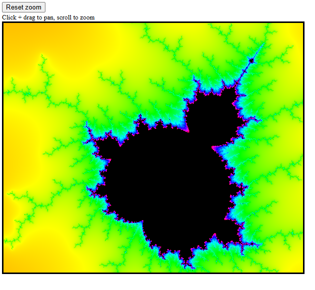

# Minimalist Web Mandelbrot Viewer!
Super easy to use mandelbrot viewer. Just click and drag to pan and scroll to zoom. You can also adjust the number of iterations to increase the sharpness or performance.

To use, paste the contents of URI.txt into any browser!

# How to use:
1) Copy URI.txt
2) Paste into url spot in browser

# How it works:
Iterates over all pixels in canvas, checks if they diverge, colors based on that. Supports zooming / panning by changing the internal boundaries.

# building?
It's just one html file, you don't need to build it.

## Wait wait how did you minify it
I manually renamed some of the functions/variables, then used https://kangax.github.io/html-minifier/ to one line it, then put it in URI.txt and replaced `%`, `#`, and ` ` with their escape codes. 

# Stuff
Built for SHRINK by hackclub (shrink.hackclub.com).

<small>Whoops didn't see that we were supposed to use some script.</small>